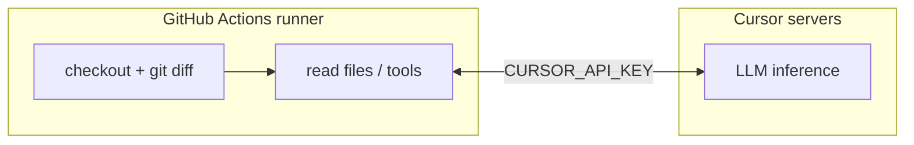
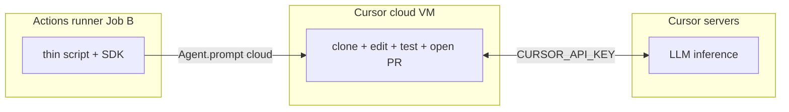

# Overview

Two-service monorepo: **FastAPI backend** (Python) and **React + Vite frontend** (JavaScript). See [backend/README.md](backend/README.md) and [frontend/README.md](frontend/README.md) for run and test commands, and [AGENTS.md](AGENTS.md) for Cursor Cloud / local dev notes.

## 1. Cursor implement issue (GitHub Actions)

When a maintainer opens an issue, [`.github/workflows/agent-issue.yml`](.github/workflows/agent-issue.yml) may trigger a cloud Cursor agent that implements the request and opens a PR. Driver script: [`.github/scripts/cursor-implement-issue.ts`](.github/scripts/cursor-implement-issue.ts).

**Setup:** add repository secret `CURSOR_API_KEY`, and install the [Cursor GitHub App](https://cursor.com/dashboard) on this repo so cloud agents can clone, push, and open PRs.

### Flow

```
GitHub                          GitHub Actions runner                Cursor cloud (*1)
(issue opened)  ─────────►    (ubuntu-latest VMs)                  (hosted VM per run)
                              ┌──────────────────────────────┐       ┌──────────────────┐
                              │ Job A: authorize             │       │ Clone repo @ ref │
                              │   gh api /collaborators/...  │       │ Read .cursor/    │
                              │   → allowed=true|false       │       │   rules, AGENTS  │
                              └──────────────────────────────┘       │ Run model:       │
                                          │ allowed (*2)             │   gpt-5.3-codex  │
                                          ▼                          │ Edit files,      │
                              ┌──────────────────────────────┐       │ run tests, etc.  │
                              │ Job B: implement             │  API  │ Open PR (GitHub  │
                              │  - checkout repo (read-only) │ ────► │   App on Cursor  │
                              │  - install @cursor/sdk, tsx  │       │   side)          │
                              │  - npx tsx                   │       └──────────────────┘
                              │      cursor-implement-issue  │              │
                              │      .ts                     │              │  PR opened
                              │      (calls Agent.prompt)    │ ◄────────────┘  references
                              │  - exit 0/1/2                │     final         "Closes #N"
                              └──────────────────────────────┘     result
```

**Notes**

1. **Cursor cloud (*1)** — PR is opened on a new branch. The Cursor GitHub App is installed and Cursor cloud holds an auth token on the original GitHub repo, so it can open a PR there (not via the Actions runner’s `GITHUB_TOKEN`). Clone, tools, and edits run on a Cursor-hosted VM; the LLM still runs on Cursor’s API (remote inference).

2. **Two jobs (*2)** — Two separate **jobs** (each gets its own runner VM) separate permissions and logic. Job A uses `contents: write` because the GitHub endpoint for collaborator permission (`GET .../collaborators/{user}/permission`) is only callable with push-level access; Job B uses read-only (`contents: read`, `issues: read`) because it only sends an HTTP call to Cursor with the repo URL—the agent runs in Cursor cloud, not on the runner.

## 2. Cursor PR review (GitHub Actions)

When a PR targets `main` or `master`, [`.github/workflows/agent-pr.yml`](.github/workflows/agent-pr.yml) runs a **local** Cursor agent on the Actions runner (not Cursor cloud). Driver script: [`.github/scripts/cursor-review-pr.ts`](.github/scripts/cursor-review-pr.ts).

**Setup:** repository secret `CURSOR_API_KEY`. Optional repo variable `CURSOR_REVIEW_MODEL` (default `claude-sonnet-4-6` in the script).

### Flow

```
GitHub                              GitHub Actions runner (single job)
(PR → main/master)  ─────────►    (ubuntu-latest VM)
                                  ┌──────────────────────────────────────┐
                                  │ Job: review                          │
                                  │  permissions: contents/read,         │
                                  │               pull-requests/read     │
                                  │                                      │
                                  │  checkout (fetch-depth: 0)           │
                                  │    → full PR tree at cwd             │
                                  │                                      │
                                  │  git diff PR_BASE_SHA...PR_HEAD_SHA  │
                                  │    → changed paths + unified diff    │
                                  │    (truncate if > 200k chars)        │
                                  │                                      │
                                  │  install @cursor/sdk, tsx            │
                                  │  npx tsx cursor-review-pr.ts         │
                                  │    Agent.prompt(..., local: { cwd }) │
                                  │         │                            │
                                  │         │  HTTP (CURSOR_API_KEY)     │
                                  │         ▼                            │
                                  │    Cursor agent uses runner cwd (*1) │
                                  │    (read .cursor/rules, AGENTS.md,   │
                                  │     nearby files; diff in prompt)    │
                                  │         │                            │
                                  │         ▼                            │
                                  │  stdout: VERDICT / SUMMARY / ...     │
                                  │  exit 0 / 1 / 2                      │
                                  └──────────────────────────────────────┘
                                            │
                                            ▼
                                  Workflow log (no PR opened,
                                  no GitHub comment step today)
```

**Notes**

1. **Local runtime (*1)** — `local: { cwd: process.cwd() }` means tools and filesystem are on the **checked-out repo on the runner**, not a Cursor cloud VM. There is no cloud clone, branch push, or `autoCreatePR`. The runner still calls Cursor’s API (`CURSOR_API_KEY`) for **LLM inference** (model runs on Cursor’s servers, not on the runner).

### Where the model runs (local vs cloud)

**Local runtime (`agent-pr`)** — workspace and tools on the runner; LLM on Cursor’s API:



**Cloud runtime (`agent-issue`)** — Job B only launches the agent; clone, tools, edits, and PR on Cursor cloud VM; LLM on Cursor’s API:



### Jobs vs runners

- A **job** is a unit in the workflow YAML; a **runner** is the VM that executes it.
- **Steps in one job** share the same runner (`agent-pr` = one job, one VM).
- **Each job** on GitHub-hosted runners gets a **new** VM (`agent-issue` = two jobs → two VMs). `needs:` passes outputs only, not disk or env.

### Related automation

| Workflow | Trigger | Runtime |
|----------|---------|---------|
| [agent-issue.yml](.github/workflows/agent-issue.yml) | Issue opened | Cursor **cloud** (`Agent.prompt` + `autoCreatePR`) |
| [agent-pr.yml](.github/workflows/agent-pr.yml) | PR to `main` / `master` | Cursor **local** on the runner ([cursor-review-pr.ts](.github/scripts/cursor-review-pr.ts)) |
